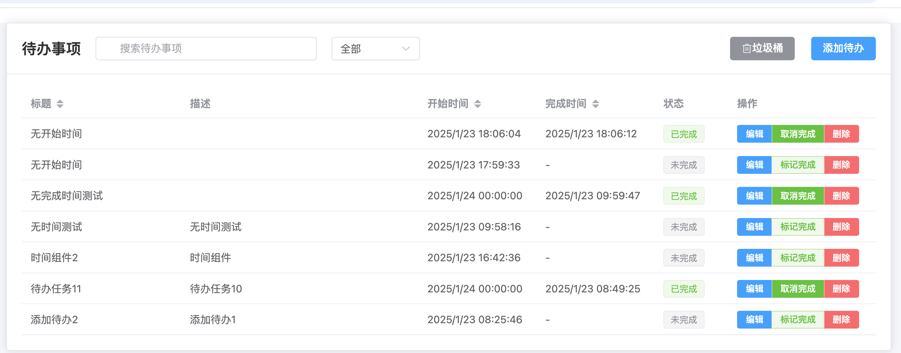

# todoListWeb

## 快速开始

### 1. 初始化数据库

```bash
# 确保在项目根目录下
# 创建并初始化SQLite数据库
sqlite3 instance/todo.db < schema.sql
```

这将创建必要的数据库表和索引。

### 2. 启动后端服务

```bash
# 激活Python虚拟环境
source venv/bin/activate

# 启动Flask服务器
python app.py
```

服务器将在 http://localhost:5000 上运行。

### 3. 启动前端服务

```bash
# 进入前端项目目录
cd frontend

# 安装依赖（如果尚未安装）
npm install

# 启动开发服务器
npm run dev
```

前端将在 http://localhost:5173 上运行。

### 4. 默认账户信息

系统预设了以下默认账户，可用于测试和体验系统功能：

```
用户名：admin
密码：admin123
```

### 5. 基本操作说明

- 使用默认账户登录系统
- 在主界面可以查看所有待办事项
- 点击"添加"按钮创建新的待办事项
- 点击待办事项可以编辑或删除
- 使用复选框可以标记待办事项为已完成

### 6. 界面预览



## 前端环境配置指南

### 1. 安装 nvm (Node Version Manager)

在macOS上使用Homebrew安装nvm：

```bash
brew install nvm
```

创建nvm工作目录：

```bash
mkdir ~/.nvm
```

将以下配置添加到shell配置文件（~/.zshrc 或 ~/.bash_profile）：

```bash
export NVM_DIR="$HOME/.nvm"
[ -s "/usr/local/opt/nvm/nvm.sh" ] && \. "/usr/local/opt/nvm/nvm.sh"  # This loads nvm
[ -s "/usr/local/opt/nvm/etc/bash_completion.d/nvm" ] && \. "/usr/local/opt/nvm/etc/bash_completion.d/nvm"  # This loads nvm bash_completion
```

重新加载配置文件：

```bash
source ~/.zshrc  # 如果使用zsh
# 或
source ~/.bash_profile  # 如果使用bash
```

### 2. 安装 Node.js

```bash
# 安装最新的长期支持版本（LTS）
nvm install --lts

# 使用已安装的版本
nvm use --lts
```

### 3. 前端项目设置

进入前端项目目录：

```bash
cd frontend
```

安装项目依赖：

```bash
npm install
```

### 4. 开发服务器

启动开发服务器：

```bash
npm run dev
```

构建生产版本：

```bash
npm run build
```

## Python环境配置指南

### 1. 安装 pyenv

在macOS上使用Homebrew安装pyenv：

```bash
brew install pyenv
```

### 2. 配置pyenv环境

将以下配置添加到shell配置文件（~/.zshrc 或 ~/.bash_profile）：

```bash
export PYENV_ROOT="$HOME/.pyenv"
export PATH="$PYENV_ROOT/bin:$PATH"
eval "$(pyenv init --path)"
eval "$(pyenv init -)"
```

重新加载配置文件：

```bash
source ~/.zshrc  # 如果使用zsh
# 或
source ~/.bash_profile  # 如果使用bash
```

### 3. 安装并配置Python 3.9.0

```bash
# 查看可安装的Python版本
pyenv install --list

# 安装Python 3.9.0
pyenv install 3.9.0

# 设置当前目录的Python版本
pyenv local 3.9.0
```

### 4. 创建并激活虚拟环境

```bash
# 创建虚拟环境
python -m venv venv

# 激活虚拟环境
source venv/bin/activate  # Unix/macOS
# 或
venv\Scripts\activate  # Windows
```

### 5. 安装项目依赖

```bash
pip install -r requirements.txt
```

### 6. 验证环境配置

```bash
# 验证Python版本
python -V  # 应显示 Python 3.9.0

# 查看已安装的包
pip list
```

### 常用命令

```bash
# 激活虚拟环境
source venv/bin/activate

# 更新依赖文件
pip freeze > requirements.txt

# 退出虚拟环境
deactivate